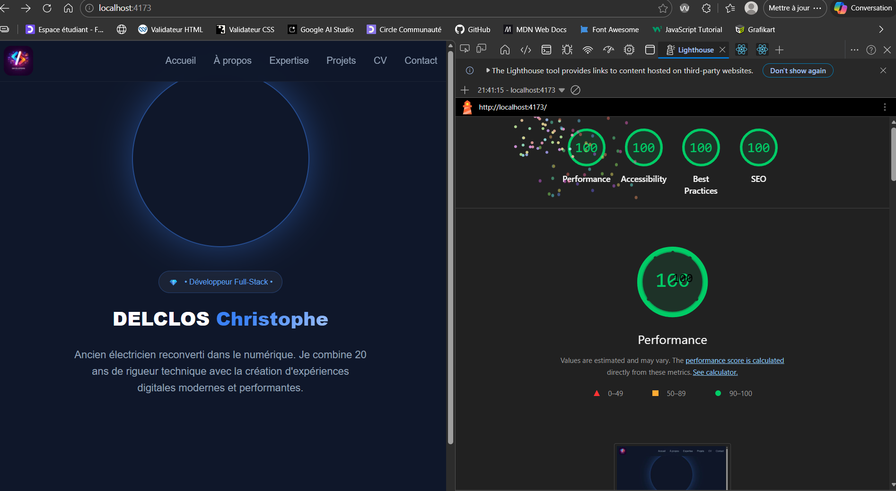

# 🚀 Portfolio de DELCLOS CHRISTOPHE


> **Projet OpenClassrooms** - Parcours Développeur Web

Ce projet est mon portfolio professionnel, conçu pour présenter mes compétences et mes réalisations techniques. Il a été développé avec une attention particulière portée à l'expérience utilisateur (UX), à la performance et à l'accessibilité.

## 🔗 Liens utiles 

🌍 Démo en ligne : https://portfolio-theta-pink-67.vercel.app
📂 Dépôt GitHub : https://github.com/Cricrou13/Portfolio.git

## ✨ Fonctionnalités

📱 Interface Responsive : Adaptée à tous les supports (Desktop, Tablette, Mobile).
⚡ Optimisation des performances : Implémentation du Lazy-loading pour les images.
♿ Accessibilité : Respect des normes WCAG pour une navigation inclusive.
🎨 Design System : Charte graphique cohérente définie en amont (Wireframes).
📁 Section Projets : Mise en avant de mes projets réalisés durant ma formation.

## 🛠️ Stack Technique 

JavaScript : React JS (Vite)
Stylisation : HTML5 / CSS3 (Sass/SCSS)
Outils de gestion : Notion (Méthodologie Agile/Kanban)
Déploiement : Vercel

## 📈 Performances & Qualité (Lighthouse)



Catégorie      |        Score
| :--- | :--- |
Performance	   |    ⚡ 100%
Accessibilité  |    ♿ 100%
Bonnes Pratiques  |	✅ 100%
SEO	          |      🔍 100%

## ⚙️ Installation & Lancement en local

**Pour faire tourner ce projet sur votre machine :**

**Cloner le dépôt :**
```
git clone https://github.com/Cricrou13/Portfolio.git
```

**Accéder au dossier :**
```
cd Portfolio
```

**Installer les dépendances :**
```
npm install
```

**Lancer le serveur de développement :**
```
npm run dev
```

Le site s'ouvrira automatiquement sur http://localhost:5173.